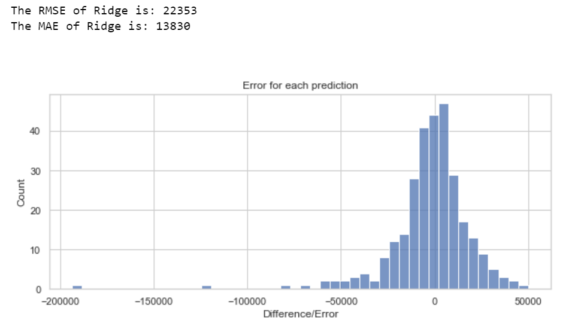

# Housing Regression Project

 

Hello! 

This is a project, whereby I attempted to **predict housing prices**, based off of a large number of features (79 initially, through processing, cleaning, and encoding categorical variables, the number of features did change, ending up at 219, mainly due to one-hot encoding). 1460 homes total are involved in the dataset, split 80% into training, and 20% into testing.

 
 

**Quick Walkthrough:**

Once the data was cleaned, and explored, modelling was performed, initially starting off with standard Multivariable Linear Regression. The model seemed fairly decent, but unfortunately there were about 3-6 extreme outliers (depending on what data ends up in the training set, from SKlearns train_test_split function), that plagued the model. 

I suspected it was due to multi-collinearity between the categorical features (them being highly linearly correlated either to each other, or to the rest of the non-target features in the dataset), and thus employed Ridge Regression. I decided on Ridge Regression, as it was designed to deal with datasets that have a potentially large number of features, that are highly linearly correlated to each other, the exact problem I thought standard linear regression was encountering.

Ridge regression worked out very nicely, solving the extreme outlier problem, and performing overall fairly well IMO (for a basic model, this project didn't involve any  random forests, or any other model ensembles). 

The **results of the Ridge Regression model** is here:

 

 

The Ridge model **predicted the sale price of 292 different homes, and on average, was off by about $13,830, according to Mean Absolute Error (MAE), or $22,353 if using Remote Mean Squared Error (RMSE), which is more sensitive to outliers.**

This does seem like a fair bit of money honestly, 13 thousand dollars and 18 thousand dollars, but proportionally speaking, the median sale price amongst all 1460 houses in the dataset, was $163,000. So **MAE / RMSE are 9% and 14% of the size of the median**, which isn't too bad IMO, especially for a fairly basic ML model, which is just a variant of Linear Regression, but for improvements, I'm very confident some different model ensembles could achieve better accuracy.

 
 
 

A thorough walkthrough of my analysis of the dataset, can be found in the Jupyter Notebook file,"HousePrices_Regression.ipynb", which includes descriptions of what I'm doing, as I go through the analysis.

This project was based off of the popular Ames housing price dataset, available on Kaggle, here:
https://www.kaggle.com/competitions/house-prices-advanced-regression-techniques/overview

*Note: data.csv is simply the dataset used, and data_desc.txt, just contains detailed descriptions, of each of the 81 features total, in the dataset.*

